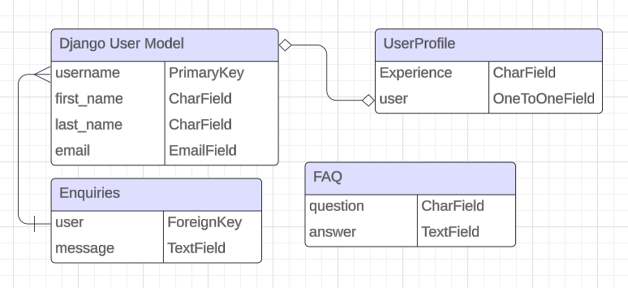
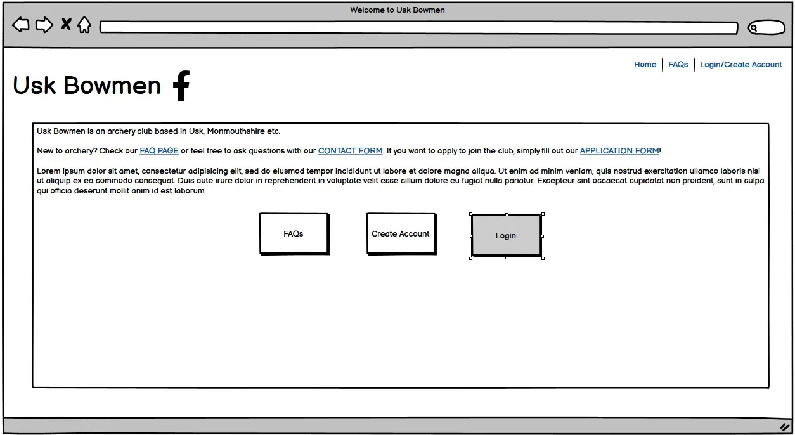
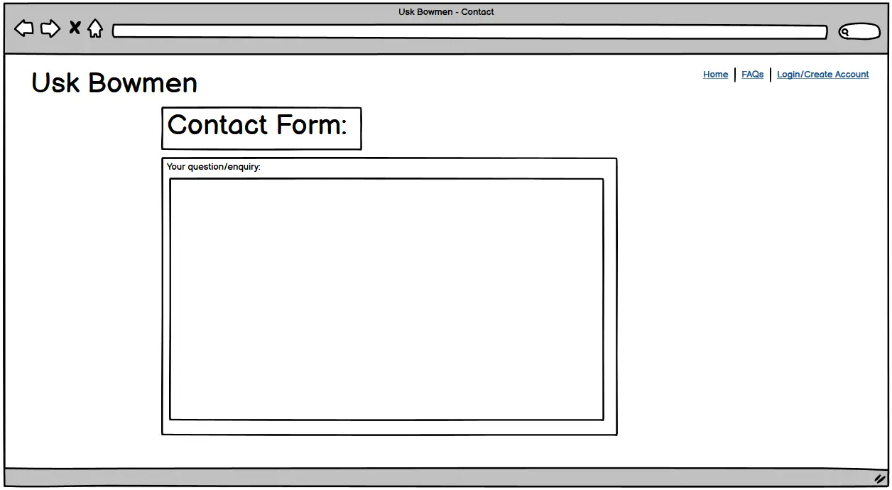
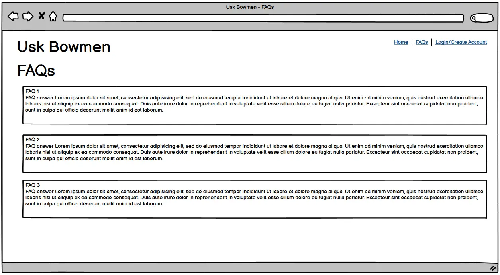
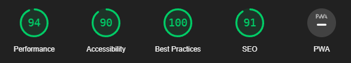

<h3>Project overview</h3>
This is a website designed for users to be able to sign up with an account that is then visible to admins. Users can create, view their account details, edit and delete their account all from the front-end. There is an FAQs page which ordinary users can access while staff-level users can again, create, edit and delete FAQs from the front end. Once users log in they can send in an enquiry which is visible to admins in the back-end and is tied to a user account.

The initial purpose of the site was to act as a store for club officers to have access to member details, with the members able to edit details themselves rather than requiring the club officers to update. During testing several users felt that the creating account process did not deliver any real benefit to them and so the "Enquiries" app was added to give logged in users a way to message the club admins.

<h3>Live site</h3>

Please click [here]() to view the live site deployed on Heroku.

<h3>Database model</h3>

The database model below shows the relation between the different models used in the site.

<h3>Agile methodology</h3>

User stories were created and tracked through github projects linked to this repo. [Click here](https://github.com/users/CBainCoding/projects/8)
Indivual tasks were handled with a kanban board on Trello. [Click here](https://trello.com/b/5C1bKULo/capstone-project)

<h3>Technologies used</h3>

- __Languages__
    - This is a full stack project using HTML, CSS and Python. 

- __Frameworks__
    - The site uses Django and Bootstrap. 
        - Django is used for the back-end structuring the project and because of the features it offers "out of the box" such as the user login and admin panel
        - Bootstrap is used for simplifying CSS styling allowing for much less CSS code in the stylesheet

- JavaScript file exists but currently only performs a simply "Hello world" print to check the JavaScript file is wired up correctly. During the project it became apparent that Python and Django were able to offer the same functionality but much more efficiently.

<h3>List of features</h3>

- __Navbar__
    - The Navbar shows links to all site pages and updates to show different buttons when logged in, the "Login/Signup" button is a dropdown that when clicked offers both a "Login" and "Create Account" button. When a user is logged in the "Login/Signup" button switches to a "Log out" button.
    - During user testing some users had difficulty reading the font due to the text colour, this was therefore changed to a brighter off-white colour to improve readability.
    - The Navbar is part of the base.html file and as all other html files extend this base.html, the Navbar remains consistent across the site.
    - On smaller devices the Navbar collapses and can be opened with the burger icon and continues the difference in links shows depending on whether the user is logged in
     
  
Navbar when not logged in
 
  
Navbar changes to show more options when logged in
 

 
On smaller screns the navbar collapses and is opened with a burger icon, again the buttons shown change depending on if user is logged in

- __FAQs__
    - The FAQs page allows users to see commonly asked questions about the club without the need to bother the club officers.
    - Club officers with staff accounts have a front-end form that allows them to add, edit and delete FAQs from this page.
    - Django messaging system used to confirm new and edited FAQs. During testing the "Delete" message does not appear which requires further investigation.
    - Confirmation page for deleting FAQs to try and avoid accidental deletions.
     

 
Staff can see additional options in the front-end to add, edit and delete FAQs
 

- __Contact__
    - Contact page was initially planned as a signup form but was changed during development as users already put in their details when signing up.
    - Features a simply text field and submit button, enquiries can be seen in the admin panel.
    - Future plan is to add an "inbox" page that only staff can access which displays these enquiries in a front-end page.
     

- __User Accounts__
    - Users can create an account which saves their details to the back-end. The purpose of this is to give club staff an online repository of club members and their details.
    - Users can edit their account through a front-end form.
    - Users can delete their acount through a front-end form.
    - Django messaging used for editing and deleting account confirmation.
    - Django verification used to check required fields filled in and filled in correctly e.g. ensuring email is correct format, passwords match and are not too similar to username
     

<h3>UX/UI</h3>

- Colour selected for Navbar is a dark "forest" green to highlight the outdoors aspect of the sport, as well as evoking images of famous archers such as Robin Hood in Sherwood Forest
- Off-White was used as text in the navbar after user testing found the previous colour difficult to read
- Similar white background was added to most features as the background image that is used (featuring traditional archery equipment again to evoke images of historical archers) made text difficult to read. A container with a transparent white background allows the image to be seen while still allowing users to read the text on top.
- Bootstrap buttons have been used for most on-page buttons as this gave an easy way to change colours and highlight "dangerous" buttons such as deleting FAQs or user accounts.
- Simple favicon featuring an archery target and an arrow hitting bullseye improves the site design and ensures users with a lot of tabs open can still see what the site is for. Favicon is coded in to the base.html so it is consistent across the site.

__Wireframes__

<h3>Testing</h3>

All pages forms have been tested and create relevent instances in the back-end. For users they can see their account through the front-end "My Account" page, staff level users can also add new FAQs to the FAQs page, as well as editing and deleting from the front-end. One bug that was found was during the "Delete Account" process the message to confirm account deletion does not display while the create and edit messages do. This requires futher investigation.

All html pages have been run through the official [W3C validator](https://validator.w3.org/). This was done by right clicking on each page and viewing source, then pasting into the validator. All pages have been tested both not logged in and logged in. For pages such as the FAQs where staff can see additional features, an additional test was performed with a staff account logged in.

Lighthouse tests have been performed across the site and results are over 90 for each score.
 

CSS stylesheet has passed the official [Jigsaw CSS validator](https://jigsaw.w3.org/css-validator/) with no errors.

    

All modified .py files have been run through the [Code Institute linter](https://pep8ci.herokuapp.com/). A lot of the code did not confirm to PEP8 standards so was reformatted correctly to meet these requirements and now passes with no errors.

All site pages and forms have been tested on multiple devices from large desktop monitors to mobile phones. The pages and forms all display correctly. Styling could be improved on some forms such as the enquiry form but this was pushed to a "Should do" requirement as the current styling meets MVP requirements.

<h3>Deployment</h3>

Check settings file to ensure your database is selected and you have included both your developer environment and heroku in the "Allowed hosts" section.
Check settings file debug mode. Currently the debug is set to be an "if" statement based on "DEBUG" being present in the env.py file, this should turn debug mode on when in your developer environment but automatically switch off when site is deployed.
Push site code to github ensuring env.py files etc. are included in .gitignore file.
Link heroku account to github account.
From heroku homepage select "New" and then "Create new app".
Name the app and select relevant region.
Open the new app and navigate to the settings tab.
You will need to add any config_vars such as database URL (DB_URL) and cloud storage.
Navigate to the "Deploy" tab and scroll to the bottom, select the github branch you wish to deploy from and select "Deploy Branch".
This may take a few minutes to deploy, when complete click the "Open app" button to view your live site.

<h3>Citation of ALL sources(code, images, text)</h3>

- FreeCodeCamp's [Python Tutorial for Beginners](https://www.youtube.com/watch?v=ZxMB6Njs3ck)
- Chat GPT - General assistance with debugging and structuring code
- Django Documentation - General assistance
- W3 Schools - General help with structuring code and debugging
- Bootstrap Documentation
- geograph.org and Peter Trimming for [background image](https://www.geograph.org.uk/photo/1983853)
- Code Institute staff and tutors who taught me and helped with debugging issues
- My mentor for helping plan, check in and reviewing the project once complete
- All text content on the site was written by the developer

<h3>Future features </h3>

- Currently the club staff have no way to access the enquiries unless given permission by the admin/superuser. I would like to add an "inbox" page that displays the enquiries in a front-end page so that staff do not need to access the admin panel.
- Similar to the enquiries, I intend to add a "Member details" page which allows staff to see a list of members and their details, if possible also export these details in a CSV file as the intention is that they can then be submitted to the national governing body to register the club members.

<h3>Known Bugs</h3>

- Delete FAQ message not showing when a user deletes from the front-end. For some reason while the messages work when creating and editing the FAQs page, the delete message does not show.
- Same email address is allowed on multiple accounts when signing up. This can be solved but was left as it is for users signing up as some club members may sign themselves and their children up on different accounts
